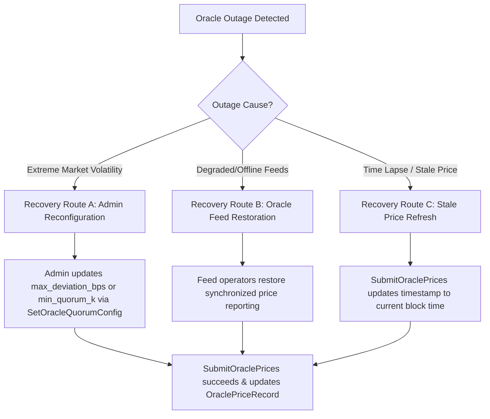

# Multi-Oracle Outage Simulation & Recovery Guidelines (`creditra-credit`)

> **Redirect — the canonical oracle reference is now
> [`docs/oracle-mechanisms.md`](./oracle-mechanisms.md).**
>
> This page covers the quorum-of-K mechanism only. The contract has **three**
> distinct oracle mechanisms, and this page does not mention the other two or how
> they interact:
>
> - **Single-price circuit breaker** (`set_oracle_config`) — bypassed entirely once
>   the quorum config is set.
> - **Quorum-of-K submission** (`set_oracle_quorum_config`, `submit_oracle_prices`)
>   — the subject of this page, and the one that takes precedence at settlement.
> - **Weighted-median registry** (`add_oracle`, `report_value`, `get_median_value`)
>   — **does not gate settlement at all**; its outage modes are invisible to
>   `settle_default_liquidation`.
>
> [`docs/oracle-mechanisms.md`](./oracle-mechanisms.md) is the canonical page: it
> documents all three, gives the precedence table derived from
> `contracts/credit/src/oracle_validation.rs`, lists the staleness rule and failure
> codes for each, and is where outage triage should start.
>
> **Staleness caveat specific to this page.** The `is_price_stale` / stale-price
> material below describes the outage model, but note that the contract enforces
> quorum staleness only in `validate_quorum_mode` at settlement time. Read the
> authoritative rules in `docs/oracle-mechanisms.md` before relying on this page for
> exact behaviour.
>
> **Stale paths in this page.** The entry-point names below use CosmWasm-style
> PascalCase (`SetOracleQuorumConfig`, `SubmitOraclePrices`, `ExecuteMsg::…`,
> `config.owner`) and the e2e test link points at a legacy
> `contracts/creditra-credit/` CosmWasm crate and a hard-coded `file:///c:/Users/…`
> path. The live Soroban crate is `contracts/credit/`, where the entry-points are
> snake_case (`set_oracle_quorum_config`, `submit_oracle_prices`) and authorization
> goes through `require_admin_auth`. This page is preserved as-is; treat the
> canonical reference as correct where the two disagree.

## Overview

The CosmWasm `creditra-credit` smart contract implements a quorum-of-K sliding window price resolution algorithm (`oracles::resolve_quorum_price`) to combine $N$ independent price feeds into a single canonical price record (`OraclePriceRecord`).

This document details oracle outage conditions, authorization controls, price staleness tracking, and three distinct recovery workflows verified by end-to-end simulation tests in [`contracts/creditra-credit/tests/e2e_outage.rs`](file:///c:/Users/cisat/Creditra-Contracts/contracts/creditra-credit/tests/e2e_outage.rs).

---

## Quorum Price Resolution Architecture

Given $N$ submitted prices and an active `OracleQuorumConfig` ($K$, `max_deviation_bps`, `max_age_seconds`):

1. **Validation**: All prices must be strictly positive ($p_i > 0$) and $N \le 20$ (`MAX_ORACLE_FEEDS`).
2. **Sorting**: Prices are sorted in ascending order.
3. **Sliding Window**: A K-wide window slides over the sorted array.
4. **Deviation Bounds Check**: The spread between highest ($P_{hi}$) and lowest ($P_{lo}$) elements in the window must satisfy:
   $$\text{deviation\_bps} = \frac{|P_{hi} - P_{lo}| \cdot 10,000}{P_{lo}} \le \text{max\_deviation\_bps}$$
5. **Lower Median**: Returns the lower-median of the first qualifying window.
6. **Error Handling**:
   - `OracleQuorumNotMet`: Returned if $N < K$, $K < 2$, or no K-wide window satisfies the deviation bound.
   - `OraclePriceInvalid`: Returned if $N = 0$, $N > 20$, any $p_i \le 0$, or if quorum config is uninitialized.

---

## Oracle Outage Modes

### 1. Excessive Price Deviation Outage
During sudden market volatility or oracle feed manipulation, feed prices diverge significantly across feeds. When no window of $K$ prices agrees within `max_deviation_bps`, `SubmitOraclePrices` fails with `ContractError::OracleQuorumNotMet`.

### 2. Feed Offline / Insufficient Submissions Outage
When external infrastructure failures result in fewer than $K$ operational feeds submitting prices ($N < K$), `SubmitOraclePrices` fails with `ContractError::OracleQuorumNotMet`.

### 3. Feed Corruption Outage
When a feed returns erroneous non-positive prices ($\le 0$) or malformed output, `SubmitOraclePrices` fails with `ContractError::OraclePriceInvalid`.

### 4. Stale Price Outage
When the elapsed time since the last canonical price update exceeds `max_age_seconds` ($\text{current\_timestamp} - \text{record.timestamp} > \text{max\_age\_seconds}$), `is_price_stale` evaluates to `true`.

---

## Outage Recovery Workflows

### Recovery Route A: Admin Parameter Reconfiguration
If high market volatility causes price spreads to temporarily exceed default deviation limits (e.g. 5%), governance can adjust `max_deviation_bps` via `ExecuteMsg::SetOracleQuorumConfig` (e.g. widening from 500 bps to 2000 bps). Submitting prices under the updated configuration succeeds immediately.

### Recovery Route B: Oracle Feed Restoration
If an outage occurred due to offline or corrupted feed infrastructure, feed operators restore healthy price streams. Once $K$ feeds report within `max_deviation_bps`, price submissions resume automatically.

### Recovery Route C: Stale Price Refresh
For stale price states resulting from elapsed time, submitting fresh oracle prices updates `OraclePriceRecord.timestamp` to `env.block.time.seconds()`, returning the contract to a fresh state.

---

## Security & State Isolation Properties

- **Authorization Protection**: `SetOracleQuorumConfig` and `SubmitOraclePrices` require owner authorization (`info.sender == config.owner`). Non-owner calls fail with `ContractError::Unauthorized`.
- **State Preservation**: Failed price submission attempts leave pre-existing `OraclePriceRecord` values intact without state corruption.
- **System Isolation**: Existing credit lines, active draws, audit trails, proof-of-reserve queries, and health factor calculations remain isolated and operational during an oracle outage.
